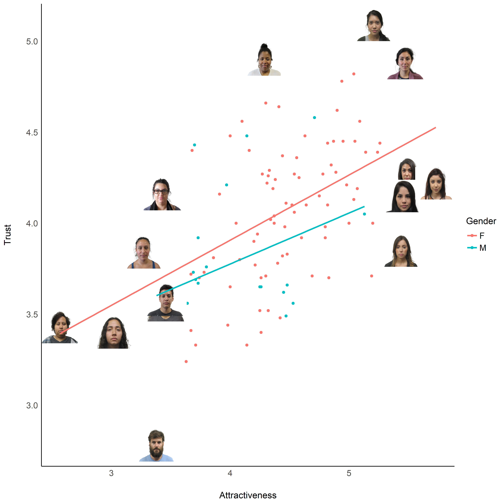

Stimuli Preprocessing
================

``` r
library(tidyverse)
library(easystats)
library(ggimage)
```

``` r

df <- read.csv("AMFD_norms.csv") |>
  filter(FType == 0) |>
  mutate(Gender = ifelse(Gender_cat == 2, "M", "F"),
         File = paste0("AMFD/N", Gender, "-", PhotoID, ".jpg"))


df_extremes <- df |>
  filter(abs(standardize(Attract_mean)) > 1.5 |
           abs(standardize(Trust_mean)) > 2)


ggplot(df, aes(x = Attract_mean, y=Trust_mean)) +
  geom_point(aes(color=Gender)) +
  geom_image(data=df_extremes, aes(image=File), size=0.1) +
  geom_smooth(aes(color=Gender), method="lm", se=FALSE) +
  theme_modern() +
  labs(x = "Attractiveness", y = "Trust")
```

<!-- -->
