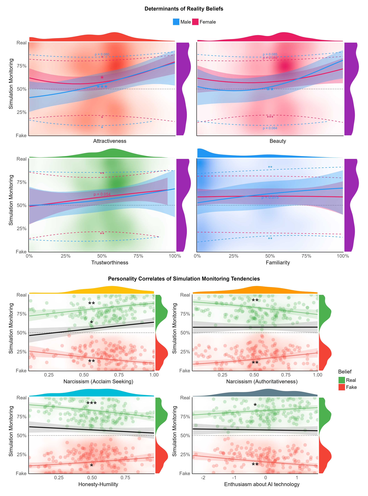

```{r, echo = FALSE, warning=FALSE, message=FALSE}
# options and parameters
options(digits = 3)

knitr::opts_chunk$set(
  collapse = TRUE,
  dpi = 450,
  fig.width = see::golden_ratio(9),
  fig.height = 9,
  fig.path = "figures/"
)

cache <- TRUE
```

<!-- stakes and Post-truth era -->

For the first time in human history, technology has enabled the creation of near-perfect simulations indistinguishable from reality. These artificial, yet realistic constructs permeate all areas of life through immersive works of fiction, deep fakes (real-like images and videos generated by deep learning algorithms), virtual and augmented reality (VR and AR), artificial beings (artificial intelligence "bots" with or without a physical form), fake news and skewed narratives, of which ground truth is often hard to access [@nightingale2022]. Such developments not only carry important consequences for the technological and entertainment sectors, but also for security and politics - for instance if used for propaganda and disinformation, recruitment into malevolent organizations, or religious indoctrination [@pantserev2020]. This issue is central to what has been coined the "post-truth era" [@lewandowsky2017beyond], in which the distinction (and lack thereof) between authentic and simulated objects will play a critical role.

<!-- Ambiguous stimuli and irrelevance of objective features -->

While not all simulations have achieved perfect realism [e.g., Computer Generated Images - CGI in movies often lack certain key details that makes them visually distinct from real images, @mcdonnell2010face], it is fair to assume that these technical limitations will become negligible in the near future, particularly in the field of face generation [@nightingale2022; @tucciarelli2020; @moshel2022]. Such performance, however, leads to a new question: if real and fake stimuli cannot be distinguished based on their objective characteristics, how can we make judgements regarding their nature?

<!-- Context -->

Literature shows that the context surrounding a stimulus often plays an important role in the assessment of its reality [a process henceforth referred to as *simulation monitoring*, @makowski2018cognitive; @makowski2019phenomenal]. With the extensive search and processing of cues within ambiguous stimuli being an increasingly complex and cognitively effortful strategy [@michael2021source; @susmann2021persuasion], people tend to draw on peripheral contextual cues (**Figure 1**), such as the source of the stimulus (e.g., in what journal has information been published), and its credibility, authority and expertise, to help facilitate their evaluation [@petty1986elaboration; @susmann2021persuasion; @michael2021source]. However, the automization and decontextualization of information allowed by online social media (where text snippets or video excerpts are mass-shared with little context) makes this task increasingly difficult [@berghel2018weaponizing; @chen2015news]. Thus, in the absence of clear contextual information, what drives our beliefs of reality?

```{r message=FALSE, warning=FALSE, fig.cap="The decision to believe that an ambiguous stimulus (of any form, e.g., images, text, videos, environments, ...) is real or fake depends of individual characteristics (e.g., personality and cognitive styles), stimulus-related features (context, emotionality), and their interaction, which can manifest for instance in our bodily reaction.", out.width="100%"}
knitr::include_graphics("../figures/Figure1.png")
```

<!-- Internal features -->

Evidence suggests that inter-individual characteristics play a crucial role in simulation monitoring, with factors such as cognitive style, prior beliefs, and personality traits [@bryanov2021determinants; @ecker2022psychological; @sindermann2020short]. For instance, individuals with stronger analytical reasoning have been found to better discriminate real from fake stimuli [@pehlivanoglu2021role; @pennycook2019lazy], and prior knowledge or beliefs about the stimulus influences one's perception of it by biasing the attention deployment towards information that is in line with one's expectations [@britt2019reasoned]. Furthermore, dispositional traits, such as high levels of narcissism and low levels of openness and conscientiousness, have been associated with greater susceptibility to fake news [@piksa2022cognitive; @sindermann2020short].

<!-- Reactive features -->

Beyond stimulus- and individual-related characteristics, evidence suggests that the interaction between the two (i.e., the subjective reaction associated with the experience of a given stimulus), contributes to simulation monitoring decisions. For instance, the intensity of experienced emotions have been shown to increase one's sense of presence - the extent to which one feels like "being there", as if the object of experience was real - when engaged in a fictional movie or a VR environment [@sanchez2005presence; @makowski2017being]. Conversely, beliefs that emotional stimuli were fake (e.g., that emotional scenes were not authentic but instead involved actors and movie makeup) were found to result in emotion down-regulation [@makowski2019phenomenal; @sperduti2017distinctive]. In line with these findings, studies on susceptibility to fake news have also found heightened stimulus emotionality to be associated with greater belief [@martel2020reliance; @bago2022emotion]. Additionally, other factors, such as the stimuli's perceived self-relevance [@sperduti2016paradox; @goldstein2009pleasure], as well as familiarity [@begg1992dissociation], could also play a role in guiding our appraisal of a stimulus.

<!-- Attractiveness -->

AI-generated images of faces, due to their popularity as a target of CGI technology and to the possibility of experimentally manipulating facial features, are increasingly used to study face processing in relationship with saliency or emotions, as well as to other important components of face evaluation, such as trustworthiness or attractiveness [@sobieraj2014beautiful; @balas2017; @tsikandilakis2019beauty; @calbi2017]. Interestingly, artificially created faces rated as more attractive (by an independent group of raters) were perceived as less real [@tucciarelli2020]. Conversely, @liefooghe2022faces reports that attractiveness ratings were significantly lower when participants who were told that the faces were AI-generated were compared to those who had no prior knowledge. Whereas this line of evidence suggests that reality beliefs have an effect on face attractiveness ratings, the opposite question - whether attractiveness could drive simulation monitoring - has received little attention to date.

<!-- Goals and hypotheses -->

This study primarily aims at exploring the effect of facial attractiveness on simulation monitoring, i.e., on the beliefs that an image is real or artificially generated. Based on the embodied reality theory [outlined in @makowski2018cognitive; @makowski2019phenomenal], which suggests that salient and emotional stimuli are perceived to be more real, we hypothesize a quadratic relationship between perceived realness and attractiveness: faces rated as highly attractive or unattractive will more likely be believed to be real. We expect a similar relationship with trustworthiness ratings given its well-established link with attractiveness [@liefooghe2022faces; @bartosik2021you; @garrido2017kdef; @little2011facial], and a positive relationship with familiarity (as more familiar faces would appear as more salient, self-relevant and anchored in reality). Additionally, we will further explore the link shared by dispositional traits, such as personality and attitude towards AI, with simulation monitoring tendencies. This study aims beyond the investigation of the discriminative accuracy between "true" photos and "true" artificially-generated images, focusing on the beliefs that a stimulus is real or fake, independently of its true nature.

## Methods

In line with open-science standards, all the material (stimuli generation code, experiment code, raw data, analysis script with complementary figures and analyses, preregistration, etc.) is available at [**https://github.com/RealityBending/FakeFace**](https://github.com/RealityBending/FakeFace){.uri}.

### Procedure

In the first part of the study, participants answered a series of personality questionnaires, including the *Mini-IPIP6* [24 items, @sibley2011] measuring 6 personality traits, the *SIAS-6* and the *SPS-6* [6 items each, @peters2012development] assessing social anxiety levels, the *FFNI-BF* [30 items, @jauk2022validation] measuring 9 facets of narcissism; the *R-GPTS* [18 items, @freeman2021revised] measuring 2 dimensions related to paranoid thinking; and the *IUS-12* [12 items, @carleton2007fearing] measuring intolerance to uncertainty. Self-rated attractiveness was also assessed using 2 items - one measuring general attractiveness ("How attractive would you say you are?", @marcinkowska2021self) and the other measuring physical attractiveness ("How would you rate your own physical attractiveness relative to the average", @spielmann2020predictive). Finally, we devised 5 items pertaining to expectations about AI-generated image technology ("I think current Artificial Intelligence algorithms can generate very realistic images"). To lower their saliency and the possibility of it priming the subjects about the task, we mixed these items with 5 items from the general attitudes towards AI scale [*GAAIS*, @schepman2020initial]. This scale was presented after the social anxiety questionnaires. 3 attention check questions were also embedded in the surveys.

In the second part of this study, 109 images of neutral-expression faces from the validated American Multiracial Face Database (AMFD, [@chen2021broadening]) were presented to the participants for 500ms each, in a randomized order, following a fixation cross display (750 ms). After each stimulus presentation, ratings of *Trustworthiness* ("I find this person trustworthy") and *Familiarity* ("This person reminds me of someone I know") were collected using visual analog scales. Notably, as facial attractiveness is a multidimensional construct, encompassing evolutionary, sociocultural, biological as well as cognitive aspects [@rhodes2006evolutionary; @han2018beauty], we assessed attractiveness using 2 visual analog scales, measuring general *Attractiveness* ("I find this person attractive") and physical *Beauty* ("This face is good-looking").

In the last part of the study, participants were informed that "about half" of the images previously seen were AI-generated (the instructions used a cover story explaining that the aim of the research was to validate a new face generation algorithm). The same set of stimuli was displayed again for 500 ms in a new randomized order. This time, after each display, participants were asked to express their belief regarding the nature of the stimulus using a visual analog scale (with *Fake* and *Real* as the two extremes). The study was implemented using *jsPsych* [@de2015jspsych], and the exact instructions are available in the experiment code.

### Participants

One hundred and fifty participants were recruited via *Prolific*, a crowd-sourcing platform recognized for providing high quality data [@peer2022]. The only inclusion criterion was a fluent proficiency in English to ensure that the experiment instructions would be well-understood. Participants were incentivised with a reward of about \textsterling 7.5 for completing the study, which took about 45 minutes to finish. Demographic variables (age, gender, sexual orientation, education and ethnicity) were self-reported on a voluntary basis.

We excluded 5 participants that either failed 2 (\>= 66%) or more attention check questions, took an implausibly short time to finish the questionnaires or had incomplete responses. The final sample included 145 participants (Mean age = 28.3, SD = 9.0, range: [19, 66]; Sex: 48.3% females, 51.0% males, 0.7% others).

### Data Analysis

The real-fake ratings (measured originally on a [-1, 1] analog scale) were converted into two scores, corresponding to two conceptually distinct mechanisms: the dichotomous *belief* (real or fake, based on the sign of the rating) and the *confidence* (the rating's absolute value) associated with that belief. The former was analyzed using logistic mixed models, which modelled the probability of assigning a face to the real (\>= 0) as opposed to fake (\< 0). The latter, as well as the other face ratings (attractiveness, beauty, trustworthiness and familiarity), was modelled using mixed beta regressions (suited for outcome variables expressed in percentages). The models included the participants and stimuli as random factors.

We started by investigating the effect of the procedure and instructions to check whether the stimuli (which were all images of real faces) were judged as fake in sufficient proportion to warrant their analysis. Additionally, we assessed the effect of the re-exposure delay, i.e., the time between the first presentation of the image (corresponding to the face ratings) and the second presentation (for the real-fake rating).

The determinants of reality beliefs were modelled separately for attractiveness, beauty, trustworthiness, and familiarity, using second order raw polynomials coefficients to allow for possible quadratic relationships (**Figure 2**). Aside from attractiveness (conceptualized as a general construct), models for beauty, trustworthiness and familiarity were adjusted for the the two remaining variables *mutatis mutandis*. We took into account the gender of participants and stimuli by retaining the stimuli that were aligned with the participants' sexual preference (e.g., female faces for homosexual females, male faces for heterosexual females, and both for bisexual participants), and modeling the interaction with the participants' gender. For the attractiveness and beauty models, we then added the interaction with the reported self-attractiveness (the average of the two questions pertaining to it) to investigate its potential modulatory effect. Finally, we investigated the inter-individual correlates of simulation monitoring with similar models (but this time, for all items regardless of the participant's gender or sexual orientation) for each questionnaire, with all of the subscales as orthogonal predictors.

```{r message=FALSE, warning=FALSE, fig.cap="Top part shows the efffect of face ratings on 1) the probability of judging a face as real vs. fake (solid line) and 2) on the confidence associated with that judgement (dashed lines) depending on the sex. Bottom part shows the effect of personality traits on the belief (black line) and the confidence associated with it (colored lines). The points are the average per participant confidence for both types of judgements. Stars indicate significance (p < .001***, p < .01**, p < .05*)", out.width="100%"}

```

The analysis was carried out using *R 4.2* [@RCoreTeam2022], the *tidyverse* [@wickham2019], and the *easystats* collection of packages [@insightArticle; @bayestestRArticle; @performanceArticle; @parametersArticle; @correlationArticle]. As all the details, scripts and complimentary analyses are open-access, we will focus in the manuscript on findings that are highly statistically significant ($p <.01$).

## Results

### Manipulation Check

Only one image file yielded a strong simulation monitoring bias (\> 85%), being classified as fake by 88.7% of participants. This image was removed from further analysis, leaving 108 trials per participant. On average, across participants, 44% of images (95%\~CI [0.12, 0.64]) were judged as fake and 56% of images (95%\~CI [0.36, 0.84]) as real. An intercept-only model with the participants and images as random factors showed that the Intraclass Correlation Coefficient (ICC), which can be interpreted as the proportion of variance explained by the random factors, was of 9.0% for the participants and 9.6% for the stimuli.

While the delay of stimulus re-exposure stimulus did not have a significant effect on participants' beliefs of reality ($OR = 1.00$, $95\%~CI = [0.99, 1.00]$ ), judgement confidence was found to be negatively associated with re-exposure delay when the faces were judged as real ($\beta = -0.006$, $95\%~CI = [-0.1, 0.002]$, $p = .004$)

<!-- There was a significant negative effect of the delay of re-exposure (with 95\% of values between 1.58 and 30.31 min), suggesting that shorter delays were associated with a slight bias towards the belief of reality (60\% at a theoretical delay of 0), which decreased to 50\% at a theoretical delay of 60 min ($OR = 0.99$, $95\%~CI = [0.99, 1.00]$, $z = -2.27$, $p = .023$). There was also a significant negative effect on judgement confidence, but only in the real condition ($\beta = -0.005$, $95\%~CI = [-0.1, 0.0]$, $p = .023$). -->

### Determinants of Simulation Monitoring

Attractiveness had a significant positive and linear relationship ($R^2_{marginal}$ = 2.0%) with the belief that a stimulus was real ($\beta_{poly1} = 16.57$, $95\%~CI = [7.33, 25.82]$, $z = 3.51$, $p < .001$) for males, and a quadratic relationship for females ($\beta_{poly2} = 7.82$, $95\%~CI = [1.81, 13.84]$, $z = 2.55$, $p = .011$), with both non-attractive and attractive faces being judged as more real. Attractiveness was also found to have a significant positive and quadratic relationship with confidence in judging faces both as real ($\beta_{poly2} = 4.30$, $95\%~CI = [0.97, 7.64]$, $z = 2.53$, $p = .011$) and as fake ($\beta_{poly2} = 5.23$, $95\%~CI = [0. 86, 9.60]$, $z = 2.35$, $p = .019$) for females. For males, however, a significant negative and quadratic relationship was found between attractiveness ratings and belief confidence only for faces judged as fake ($\beta_{poly2} = -9.92$, $95\%~CI = [-18.99, -0.86]$, $z = -2.15$, $p = .032$). There was no interaction with reported self-attractiveness.

Beauty, adjusted for trustworthiness and familiarity, had a significant positive and linear relationship ($R^2_{marginal}$ = 2.0%) with the belief that a stimulus was real ($\beta_{poly1} = 11.82$, $95\%~CI = [4.28, 20.21]$, $z = 2.76$, $p = .006$) for males only. No effect on confidence was found, aside from a quadratic relationship in females for faces judged as fake, suggesting that non-beautiful and highly beautiful faces were rated as fake with more confidence than average faces ($\beta_{poly2} = 7.84$, $95\%~CI = [3.39, 12.29]$, $z = 3.46$, $p < .001$). There was no interaction with reported self-attractiveness.

Trustworthiness, adjusted for beauty and familiarity, had a predominantly positive and linear relationship ($R^2_{marginal}$ = 2.0%) with the belief that a stimulus was real ($\beta_{poly1} = 6.44$, $95\%~CI = [-0.11, 13.00]$, $z = 1.93$, $p = .0054$) for females only. No effect on confidence was found for males, whereas a quadratic relationship was found for females for both faces judged as real ($\beta_{poly2} = 6.14$, $95\%~CI = [2.13, 10.14]$, $z = 3.00$, $p = .003$) as well as fake ($\beta_{poly2} =6.12$, $95\%~CI = [1.49, 10.75]$, $z = 2.59$, $p = .001$), suggesting that non-trustworthy and highly trustworthy faces were rated with more confidence than average faces.

We did not find any significant relationships for familiarity adjusted for beauty and trustworthiness ($R^2_{marginal}$ = 2.0%). However, a significant positive and linear relationship was found between familiarity and the confidence judgements of rating faces as real ($\beta_{poly1} = 9.98$, $95\%~CI = [3.83, 16.13]$, $z = 3.18$, $p = .001$) whereas a negative linear relationship was found with those judged as fake ($\beta_{poly1} = -12.41$, $95\%~CI = [-20.27, -4.54]$, $z = -3.09$, $p = .002$) for males only. This hence suggests that males more confidently judge faces as real with when they are familiar, and as fake when they are unfamiliar.

### Inter-Individual Correlates of Simulation Monitoring

The models including the personality traits suggested that *Honesty-Humility* had a significant negative relationship with the confidence associated with real as well as fake judgements ($\beta_{real} = -1.62$, $95\%~CI = [-2.55, -0.70]$, $z = -3.43$, $p < .001$; $\beta_{fake} = -1.16$, $95\%~CI = [-2.09, -0.23]$, $z = -2.45$, $p = 0.014$).

Significant positive associations were found between the probability of judging faces as real and dimensions of narcissism such as *Acclaim Seeking* ($\beta = 2.24$, $95\%~CI = [1.17, 4.27]$, $z = 2.44$, $p = .015$), and *Manipulativeness* ($\beta = 0.47$, $95\%~CI = [0.25, 0.87]$, $z = -2.4$, $p = 0.017$). Confidence judgements also shared significant links with narcissism through various facets, such as a positive relationship between the confidence for both real and fake judgements with *Acclaim Seeking* ($\beta_{real} = 1.65$, $95\%~CI = [0.59, 2.70]$, $z = 3.07$, $p =.002$; $\beta_{fake} = 1.62$, $95\%~CI = [0.56, 2.68]$, $z = 3.00$, $p = .003$), and a negative relationship with *Authoritativeness* ($\beta_{real} = -1.57$, $95\%~CI = [-2.58, -0.57]$, $z = -3.08$, $p = .002$; $\beta_{fake} = -1.49$, $95\%~CI = [-2.50, -0.48]$, $z = -2.89$, $p = .004$).

A positive trend was found in the relationship between the *Persecutory Ideation* dimension of paranoid thinking and the belief that the faces were real ($\beta = 1.87$, $95\%~CI = [0.99, 3.54]$, $z = 1.93$, $p = .054$).

The *Prospective Anxiety* aspect of intolerance to uncertainty shared a negative trend in its association with confidence ratings ($\beta_{real} = 1.43$, $95\%~CI = [0.10, 2.76]$, $z = 2.10$, $p = .036$; $\beta_{fake} = -0.91$, $95\%~CI = [-1.93, 0.11]$, $z = -1.75$, $p = .081$). No significant effect was found for social anxiety.

Questions pertaining to the attitude towards AI were reduced to 3 dimensions through factor analysis, labelled AI-Enthusiasm (loaded by items expressing interest and excitement in AI development and applications), AI-Realness (loaded by items expressing positive opinions on the ability of AI to create realistic material), and AI-Danger (loaded by items expressing concerns on the unethical misuse of AI technology). However, only AI-Enthusiasm displayed a significant positive relationship with the confidence in both real and fake judgements ($\beta_{real} = 0.21$, $95\%~CI = [0.02, 0.40]$, $z = 2.20$, $p = .028$; $\beta_{fake} = 0.31$, $95\%~CI = [0.12, 0.50]$, $z = -8.90$, $p < 0.001$).

## Discussion

This study aimed at investigating the effect of facial ratings (attractiveness, beauty, trustworthiness and familiarity) on simulation monitoring, i.e., on the belief that a stimulus was artificially generated. Most strikingly, despite all the stimuli being real faces from the same database, all participants believed (to high degrees of confidence) that a significant proportion of them were fake. This finding not only attests to the effectiveness of our instructions, but highlights the current levels of expectation regarding CGI technology. The strong impact of prior expectations and information on reality beliefs demonstrated here underlines the volatility of our sense of reality. In fact, stimuli-related and participant-related characteristics accounted together for less than 20% of the beliefs variance, suggesting a large contribution of other subjective processes.

<!-- Attractiveness: females -->

Although attractiveness did not seem to be the primary drive underlying simulation monitoring of face images, we do nonetheless report significant associations, with a different pattern observed depending on the participant's gender. The quadratic relationship found for female participants is aligned with our hypothesis that salient faces (i.e., rated as very attractive or very unattractive) are judged to be more real. The fact that this effect did not reach significance for beauty underlines that attractiveness judgement, and its role in simulation monitoring, is a multidimensional construct that cannot be reduced to physical facial attractiveness, in particular for women [@buunk2002age; @qi2022gender]. In fact, female participants were more confident in judging faces as fake only when they were rated very high or low on beauty, suggesting that physical beauty and attractiveness are not analogous in their effects on simulation monitoring decisions.

<!-- Attractiveness: males -->

Interestingly, we found a significant positive linear relationship in male participants for both attractiveness and beauty on simulation monitoring that we could interpret under an evolutionary lens. Specifically, males purportedly place more emphasis on facial attractiveness as a sign of reproductive potential, as compared with females, who tend to value characteristics signaling resource acquisition capabilities [@qi2022gender; @fink2006facial; @buunk2002age]. It is thus possible that the evolutionary weight associated with attractiveness skewed the perceived saliency of men towards attractive faces, rendering them significantly more salient than unattractive faces, and in turn distorted the relationship with simulation monitoring. However, future studies should test this saliency-based hypothesis by measuring constructs closer to salience and its effects, for instance using neuroimaging [@lou2015perceptual; @indovina2007dissociation] or physiological markers [e.g., heart rate deceleration, @skora2022functional].

<!-- even after adjusting for the effects of trustworthiness and familiarity; both characteristics that are evolutionarily advantageous [@hou2019survival; @little2011facial]. A -->

<!-- trustworthiness -->

Our results found a positive linear trend between trustworthiness and simulation monitoring for females only. Given prior evidence that faces presented as computer-generated were rated less trustworthy [@liefooghe2022faces; @hoogers2021effect; @balas2017], we expected such a linear association to be more clearly present for both genders. One of the underlying mechanisms that possibly contributed to this dimorphism could be the increased risk-taking aversion reported in females [explained evolutionarily as a compromise to their reproductive potential, @van2020sex], to which perceived facial trustworthiness relates [@hou2019survival]. However, if that was the case, faces judged as highly untrustworthy should have appeared as even more salient (representing an evolutionary threat), and hence be judged as more real, leading to a quadratic relationship between trustworthiness and simulation monitoring instead. Further studies are needed to investigate the causes of the increased simulation monitoring sensitivity to trustworthiness in females.

<!-- familiarity -->

Contrary to our hypothesis, we did not find familiarity to be significantly related to simulation monitoring decisions. Interestingly, there were significant linear relationships between familiarity and confidence judgements for males only, where familiarity increased the confidence of reality beliefs. Although the familiarity measure was not a "recognition" measure, evidence from studies pertaining to the latter could be linked, reporting better face memory for females [@mishra2019gender; @lewin2002sex; @sommer2013sex], as well as an overconfidence in face recall for males [@bailey2021gender; @herbst2020gender]. However, it should be noted that the present study's distribution of familiarity ratings was strongly skewed, and only a low number of pictures was rated as highly familiar. As such, future studies should clarify this point by experimentally manipulating familiarity, for instance by modulating the amount of exposure to items before querying the simulation monitoring judgements.


<!-- inter-indiv correlates -->

Regarding the role of inter-individual characteristics in simulation monitoring tendencies, we found higher scores of honesty-humility - a trait related to an increased risk perception and aversion [@levidi2022understanding; @weller2012honest] - to be related to a lower confidence in simulation monitoring judgements. Notably, greater narcissistic tendencies in dimensions such as acclaim seeking and manipulativeness were associated with a higher number of faces judged as real. This is in line with recent research which found people with narcissism to be less likely to engage in analytical reasoning strategies such as reflective thinking [@littrell2020overconfidently; @ahadzadeh2021social], and to be more vigilant and attentive to external stimuli [@carolan2017searching; @grapsas2020and; @eddy2021self].

Moreover, putting the significant positive links between narcissistic acclaim seeking and confidence judgements in perspective with the negative correlation between honesty-humility and narcissism [@hodson2018dark], we confirm previous evidence regarding the relationship between narcissistic grandiosity and over-confidence in decision-making [@campbell2004narcissism; @chatterjee2017master; @brunell2017narcissism; @o2021grandiose]. Although an inverse effect was found for the narcissistic facet of authoritativeness, we interpret this relationship as related to a higher response assertiveness. Taken together, these results suggest that participants with low humility and high recognition desires are more confident in their judgement regarding the real or fake nature of ambiguous stimuli. Alternatively, participants with opposite traits might perceive a higher risk in the decision-making process and its potential consequences (e.g., being seen as bad at the task at hand), resulting in more conservative confidence ratings.


<!-- Social Anxiety, Paranoia and Uncertainty Intolerance -->

Our findings suggest - though with weak significance - a positive link between paranoid ideation and the tendency to believe that the stimuli were real. Given previous reports that people with higher levels of paranoia are more sensitive to cues of social threat [@fornells2015people; @freeman2003can; @king2017paranoia], it is plausible that paranoid traits confer greater saliency and emotionality to observed faces, hence increasing perceptions of its realness. This hypothesis, if confirmed by future studies, would be in line with previous findings that persecutory delusions are predicted by a greater sense of presence in VR environments populated with virtual characters [@freeman2005psychology].

<!-- In contrast, intolerance to uncertainty, a trait related to aversion towards unpredictable situations, was found to be negatively correlated to individuals' confidence in real judgements [@chen2016intolerance; @jensen2014intolerance]. This is consistent with previous reports that uncertainty intolerance correlates with under-confidence in decision-making in ambiguous scenarios [@wei2021confidence; @jensen2014intolerance]. Interestingly, no significant effect on individuals' perceptions of realness was observed despite uncertainty intolerance being commonly associated with enhanced threat appraisal [@zheng2022worry; @chen2016intolerance; @jensen2014intolerance]. To this end, recent studies have attempted to disentangle the perception of threat from the experience of negative affect in ambiguous situations, conceptualising uncertainty intolerance as a response to unpredictability independent of threat altogether [@pepperdine2018disentangling; @milne2019review]. Taking this into perspective with the positive relations found between paranoid traits and beliefs of reality, future studies could clarify the role of threat appraisal on simulation monitoring processes, and attempt to delineate the specific mechanisms involved. -->


<!-- In fact, the only trait that modulated the tendency to rate an image as fake or real was the social phobia score, whereby low values were associated with an increased tendency to judge faces as real. Social phobia being characterized as a heightened fear in social interaction contexts [@kolassa2006psychophysiological; @ran2017impact], the nature of the stimuli - pictures of faces - could play a role in this association. However, given the fact that neutral faces are perceived as more threatening by participants with high social phobia [@yoon2008interpreting; @staugaard2010threatening; @peschard2017overestimation], and thus likely more salient, we would have expected high social phobia tendencies to be associated with a bias towards reality judgement. This apparent contradiction could be explained through the lens of fictional reappraisal,  **TODO: can you double check that this last statement is correct?**.  -->


<!-- AI attitudes -->

Despite the ubiquity of AI, the literature pertaining to the influence of people's AI attitudes on simulation monitoring is scarce. Contrary to our expectations, we did not find evidence for the role of participants' expectations regarding the capabilities of AI technology (in terms of the realism of its productions). Instead, we found only one's enthusiasm about AI technology to be related to an increased confidence in simulation monitoring ratings. This could potentially be because participants with a highly positive attitude towards AI perceive themselves as having greater knowledge about AI and its capabilities [@said2022artificial], hence permitting themselves to be more confident in their simulation monitoring decisions. In fact, this result is in line with reports that AI attitudes interacts with people's perceived self-knowledge to influence their perception of the opportunities and risks accorded by AI applications [@said2022artificial].

<!-- Re-exposure Delay -->

On a methodological level, although the order of presentation of the facial images was randomized to reduce effects of adaptation, participants were more confident in their judgements for faces perceived as real following a shorter re-exposure delay. Such shorter durations could be associated with the faces being better remembered and appearing more familiar, thereby triggering self-referential and autobiographical memory processing during the repeated display [@abraham2009reality; @gobbini2013prioritized; @taylor2009neural]. Indeed, this finding is consistent with studies in which fictional stimuli that were associated with familiarity up-regulated emotions, biasing its salience and perceived realness [@sperduti2016paradox; @makowski2017being]. However, if that was the case, we would expect shorter re-exposure delays to impact the decision bias as well towards reality, rather than simply the confidence. Future studies should further investigate the modulatory effects of types and degrees of familiarity on perceived realness judgements.

<!-- Limitations -->

Several limitations have to be noted. The current experimental paradigm required participants to judge the realness of faces they had prior exposure to (which was done to prevent reality judgements from influencing the other ratings). Although the effect of re-exposure delay was negligible, the potential bias induced by face familiarity (as compared to judging completely new items) cannot be discarded. Future studies could examine that by incorporating novel face images or increasing the duration of the re-exposure delay. Moreover, the magnitude of the effects found in the study was relatively small, suggesting that the facial features measured in the study were not the key determinants of simulation monitoring. Hence, beyond exploring new potential mechanisms, future studies should include a more thorough debriefing to try to capture what conscious strategies (if any) the participants used (e.g., focusing on some features of the stimulus - like hair or eyes in the case of faces) to guide their reality beliefs.


<!-- Conclusion -->

In summary, the aim of the present study was to examine whether a subset of specific characteristics, in particular face attractiveness, significantly influences our simulation monitoring decisions. Notably, we found faces rated as attractive to be perceived as more real, with a possible sexual dimorphism affecting the shape of the relationship. We also found that inter-individual traits, such as narcissistic acclaim-seeking and manipulativeness, as well as persecutory ideation, were related to a systematic bias towards beliefs that the stimuli were real or fake. We hope subsequent works to further our understanding of the factors driving the reality beliefs pertaining to ambiguous stimuli, an question becoming increasingly pertinent given the rapid technological advances. 


# Funding

This work was supported by the Presidential Postdoctoral Fellowship Grant (NTU-PPF-2020-10014) from Nanyang Technological University (awarded to DM) and the Intra-CREATE Seed Collaboration Grant (NRF2021-ITS008-0010) from the National Research Foundation, Prime Minister’s Office, Singapore, under its Campus for Research Excellence and Technological Enterprise (CREATE) programme (awarded to DM and PM).

# Acknowledgments

We would like to thank Taong Ren Qing Malcolm for his contribution to the selection of the materials.

\newpage

# References

::: {#refs custom-style="Bibliography"}
:::
